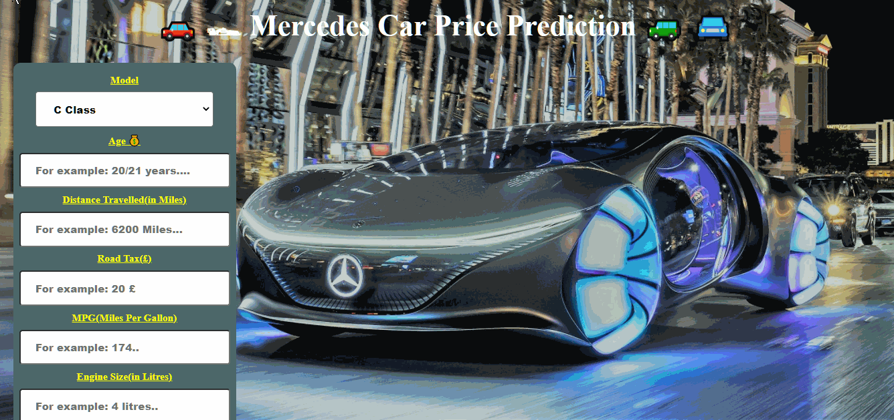

# Mercedes-Used-Cars-Price-Prediction

 

This repository consists of files required for end to end implementation of Machine Learning Mercedes Car Price Prediction web application created with Flask.

### Dataset
You can find the dataset [here.](https://www.kaggle.com/nitinchoudhary012/mercedes-car-price-prediction/data?select=merc.csv)

A glimpse of the web app:

## Please do ⭐ the repository, if it helped you in anyway.
